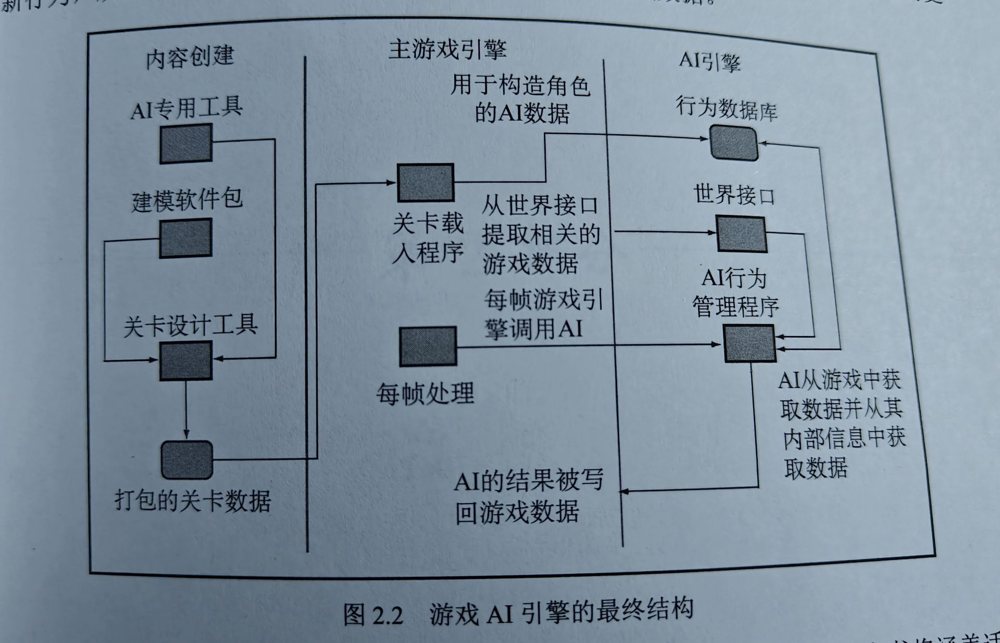

## 第一章 导论
### 1.2 游戏AI模型

AI任务分为三个部分：易懂、决策和策略，前两者包含对各个角色都有效的算法，最后一部分适用于整个团队或游戏中的一方。围绕这3个AI元素的是一整套额外的基础架构。  
  
并非所有游戏应用程序都要用到所有等级的AI，例如棋牌类只需要策略部分，一些平台游戏则用不到策略部分

#### 1.2.1 移动
  指将决策转化为某种类型的运动(Motion)的算法。不仅仅是简单的移动，还包含避障，很多动作可以直接通过动画来表现。

#### 1.2.2 决策
  决策涉及计算出一个角色下一步该做什么。一般情况下每个角色都有一套不同行为，决策系统需要确定角色在每个时刻最适合采取哪一种行为，然后才可以通过动作执行行为。

#### 1.2.3 策略
  在本书的语境下，策略是指由一组角色所使用的整体方法，在这个类别中的AI算法不会仅控制一个角色，而是影响整个角色团队的行为。团队下的每一个角色都有自己的移动和决策，但是总体上它们的决策制定将受到群体策略的影响。

#### 1.2.4 基础架构
  AI算法只是AI模型中的一半，真正为游戏构建AI还需要另一半，即一整套额外的基础架构。我们需要通过使用动画和越来越多的物理模拟将运动请求转化为游戏中的动作。  
  同样的AI也需要来自游戏的信息才能做出明智的决策，这有时被称为“感知”，它需要清楚角色知道什么信息。在实践中它比模拟每个角色可以看到或听到的内容更广泛，但包括游戏世界和AI之间的所有接口。  
  最后开发人员需要管理整个AI系统，以便使用最适量的处理器时间和内存，虽然对于游戏的每个区域通常存在某种执行管理（例如用于渲染的细节级别算法），但是管理AI提出了它自己的一整套技术和算法。  
  可以认为，这些组件中的每一个都不属于AI开发人员的职权范围，但它们对于让AI工作至关重要，完全无法避免。本书内容涵盖了除动画外的每个基础架构组件主题。

#### 1.2.5 基于代理的AI
  本书描述的模型是基于代理的模型。  
  在人工智能领域，Agent通常是指驻留在某一环境下，能持续自主地发挥作用，具备驻留性、反应性、社会性和主动性等特征的计算实体。Agent可以是软件实体，也可以是硬件实体。所以可以这样理解：Agent是人在AI环境中的代理，是完成各种任务的载体。  
  本书语境下，基于代理的AI和生成的自主角色有关，也就是说游戏中的代理就是游戏中的角色。

## 第二章 游戏AI
### 2.1 复杂度谬误
#### 2.1.1 简单的AI也能做得很好
#### 2.1.2 复杂的AI也可能很糟糕
#### 2.1.3 感知窗口
  除非你的AI控制着一个永远存在的伙伴或一对一的敌人，否则玩家遇到角色时一般都只有很短的交互时间。开发人员要确保角色的AI与它在游戏中的目的相匹配，也要确保和该AI受到玩家的注意程度相匹配（例如当玩家潜行未被发现时保持漫游，当玩家潜行被发现时，AI就不能继续漫游的行为，而需要变成追踪靠近玩家的行为）。玩家交互和AI交互的这段时间就是感知窗口。
#### 2.1.4 行为的变化
  感知窗口不仅和时间有关，还和游戏中角色的行为有关，需要依据角色的行为改变而发生改变。
  
### 2.2 游戏中的AI类型
#### 2.2.1 借鉴技术
#### 2.2.2 启发式方法
  在最初解决问题时，启发式算法是很好的起点：  
  1.最大约束  
    给定世界当前的状态，需要选定一个集合中的某个项目(project)，被选定的项目是少数几个状态中最合适的选项。  
  2.先难后易  
    最困难的事情往往会影响到很多其他的行动，所以最好先做困难的事情。  
  3.首先尝试最有前景的事情  
    给出一个优先级（例如随合理性依次对行为依次给出从高到低的分数），或许通过分数明显不够准确，但比纯随机的性能表现好。
#### 2.2.3 算法
  
### 速度和内存限制
#### 2.3.1 处理器问题
#### 2.3.2 低级语言问题
#### 2.3.3 内存问题
  但通常情况下AI算法不需要大量内存，一般情况下几十甚至几MB字节，对于MMO也只在GB的级别上。
#### 2.3.4 平台
  
### 游戏AI引擎
#### 2.4.1 游戏AI引擎的结构
  它们符合前文“游戏AI模型”一图所示。  
  第一，开发人员必须拥有两个类别的基础架构。一类是管理AI行为的一般性机制。例如决定何时运行哪些行为；另一类是用于将信息传递到AI的世界接口系统。开发人员创建的每个AI算法都需要遵守这些规则。  
  第二，开发人员必须有办法将AI想要做的任何事情转化为屏幕上的行动。  
  第三，标准行为结构必须充当两者之间的联络员。也就是在全新的AI开发完成之后，可以简单替换占位行为。
  
### 2.4.2 工具问题
  完整的AI引擎将有一个AI算法的中央池，可以应用于许多角色，因此特定角色AI的定义将包括数据，而不是编译代码。需要稳定可靠的工具链。

### 2.4.3 综述

数据在工具中创建，然后打包以后再游戏中使用，加载关卡以后，游戏AI行为根据关卡数据创建并在AI引擎中注册。游戏过程中，主游戏代码调用AI引擎，该引擎将更新行为，从世界接口获取信息并最终将其输出应用于游戏数据。
