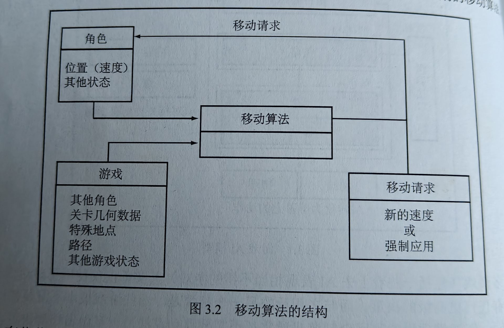

## 第三章 移动
### 3.1 移动算法基础

所有移动算法都具有相同的基本形式。它们可以获取关于自身状态和世界状态的几何数据，并且提出表示它们想要做出的移动的几何输出。如上图所示。

#### 3.1.1 二维移动
  很多移动AI只能在二维上实现，大多数经典算法也是只针对这种情况定义的。角色被假设以点的形式存在。  
  
  许多移动算法假设角色可以被视为单个的点。碰撞检测、避开障碍物和其他一些算法均使用角色的大小来影响它们的结果，但是移动本身却假设角色在一个点上。就像物理学程序开发人员所使用的过程，游戏中的对象可以视为位于其质心的刚体。碰撞检测和其他力可以应用于对象上的任何位置，但是确定对象移动的算法会转换它们，因此它只能处理质心。
  
#### 3.1.2 静止状态
  二维中的角色用x和z这两个垂直于重力方向并且相互垂直的坐标轴表示对象位置，x-z这组参考轴被称为2D空间的标准正交基。  
  
  除开x和z两个坐标轴外，面向不同方向的对象还有一个方向值，方向值表示参考轴的角度。本书使用逆时针角度，以弧度为单位，从正z轴开始。游戏引擎中默认情况下，方向值为0，角色正对的方向就是z轴正方向。  
  
  使用x、z和方向值可以给出角色的静止状态，操纵此数据的算法或方程式称为静止状态，因为该数据中未包含有关角色移动的任何信息。
  ```数据结构
  public class Static
  {
    Vector2 position;
    float orientation;//orientation表示角色面向的方向，而rotation表示改变方向的过程
  }
  ```
##### 3.1.2.1 关于2.5D
  在2.5D中开发人员可以使用完整的3D位置，但将方向表示为单个值，就像在二维中一样。开发人员只需要担心的是移动的唯一分量——绕up方向的旋转（角色的上下前后移动、跳跃等等动作都是动画效果，际上移动相关的坐标在角色的脚底）。本书第三章中应用于2D的算法都适用于2.5D。
##### 3.1.2.2 数学
  某些情况下用矩阵和三角函数表示向量来表示旋转会方便一些。

#### 3.1.3 运动学
  移动算法：根据位置和方向计算目标速度，从而允许目标速度立即改变。  
  运动学算法：相比于移动算法看起来更加真实，根据牛顿第二定律，在现实世界中速度和方向不会立即改变，为了追求真实性或者应对无法快速加速减速的角色，通过运动学算法，通过改变加速度改变当前速度，这样做会使得改变更平滑。
  ```数据结构
  public class Kinematic//运动学数据，运动和位置
  {
    Vector2 position;
    float orientation;//orientation表示角色面向的方向，而rotation表示改变方向的过程
    float velocity;
    float rotation;//角速度
  }
  
  public class SteeringOutput//角色转向加速度输出
  {
    Vector2 linear;//加速度
    float angular;//角加速度
  }
  ```

##### 3.1.3.1 独立朝向
  角色移动方向和角色朝向不会被自动联系起来，如果不加调整就可能会出现的事情是角色的移动和当前朝向南辕北辙这种事，但是大多数角色都不应该以这种方法行事，它们应该自我定向使得可以朝自己面对的方向前进。许多转向行为忽视了朝向，它们直接在角色数据的线性分量上运行，这种情况下应该做的是更新角色朝向，使其与角色移动的方向相匹配。  
  是角色与其移动的方向相匹配，可以直接设置角色的朝向为移动方向，但这么做的问题在于角色的朝向发生突然改变时会很生硬，没有一个中间状态衔接（例如转身）。因此相比于单帧直接设置角色朝向，多帧实现平滑运动，角色每一帧中均修正其方向，这样子做的效果比单帧直接设置角色朝向的效果好。
  ```个人理解
  最直接改变方向在某些实际上需要转身动作衔接的游戏里也在运用，作个对比，Dota2的英雄是有转身速度的，通过敏捷可以提高转森速度，但即便如此和直接转向仍然有差别，这是上文中推崇的需要实现的多帧平滑转动。但是英雄联盟中英雄单位是没有转身速度的，它使用本书不去涉及的动画效果完成视觉上的衔接，实际上是立即设置了朝向，中间的所有东西通过混合动画来完成，这同样是一种做法。
  ```

##### 3.1.3.2 更新位置和方向
