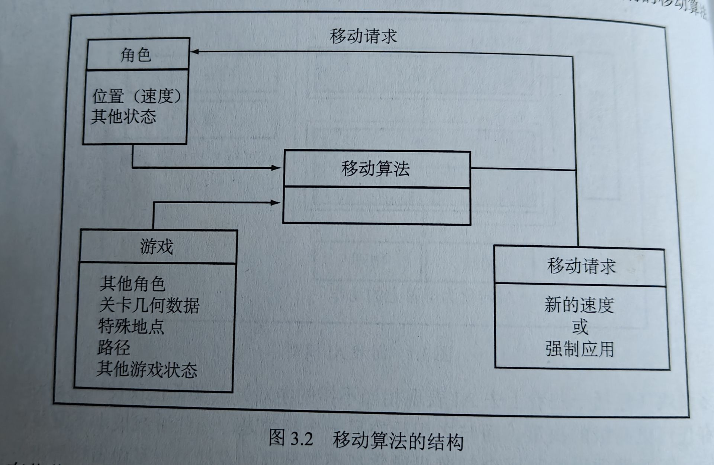

## 第三章 移动
### 3.1 移动算法基础

所有移动算法都具有相同的基本形式。它们可以获取关于自身状态和世界状态的几何数据，并且提出表示它们想要做出的移动的几何输出。如上图所示。

#### 3.1.1 二维移动
  很多移动AI只能在二维上实现，大多数经典算法也是只针对这种情况定义的。角色被假设以点的形式存在。  
  
  许多移动算法假设角色可以被视为单个的点。碰撞检测、避开障碍物和其他一些算法均使用角色的大小来影响它们的结果，但是移动本身却假设角色在一个点上。就像物理学程序开发人员所使用的过程，游戏中的对象可以视为位于其质心的刚体。碰撞检测和其他力可以应用于对象上的任何位置，但是确定对象移动的算法会转换它们，因此它只能处理质心。
  
#### 3.1.2 静止状态
  二维中的角色用x和z这两个垂直于重力方向并且相互垂直的坐标轴表示对象位置，x-z这组参考轴被称为2D空间的标准正交基。  
  
  除开x和z两个坐标轴外，面向不同方向的对象还有一个方向值，方向值表示参考轴的角度。本书使用逆时针角度，以弧度为单位，从正z轴开始。游戏引擎中默认情况下，方向值为0，角色正对的方向就是z轴正方向。  
  
  使用x、z和方向值可以给出角色的静止状态，操纵此数据的算法或方程式称为静止状态，因为该数据中未包含有关角色移动的任何信息。
  ```数据结构
  public class Static
  {
    Vector2 position;
    float orientation;//orientation表示角色面向的方向，而rotation表示改变方向的过程
  }
  ```
##### 3.1.2.1 关于2.5D
  在2.5D中开发人员可以使用完整的3D位置，但将方向表示为单个值，就像在二维中一样。开发人员只需要担心的是移动的唯一分量——绕up方向的旋转（角色的上下前后移动、跳跃等等动作都是动画效果，际上移动相关的坐标在角色的脚底）。本书第三章中应用于2D的算法都适用于2.5D。
##### 3.1.2.2 数学
  某些情况下用矩阵和三角函数表示向量来表示旋转会方便一些。

#### 3.1.3 运动学
  移动算法：根据位置和方向计算目标速度，从而允许目标速度立即改变。  
  运动学算法：相比于移动算法看起来更加真实，根据牛顿第二定律，在现实世界中速度和方向不会立即改变，为了追求真实性或者应对无法快速加速减速的角色，通过运动学算法，通过改变加速度改变当前速度，这样做会使得改变更平滑。
  ```数据结构
  public class Kinematic//运动学数据，运动和位置
  {
    Vector2 position;
    float orientation;//orientation表示角色面向的方向，而rotation表示改变方向的过程
    float velocity;

    float rotation;//角速度
  }
  
  public class SteeringOutput//角色转向加速度输出
  {
    Vector2 linear;//加速度
    float angular;//角加速度
  }
  ```

##### 3.1.3.1 独立朝向
  角色移动方向和角色朝向不会被自动联系起来，如果不加调整就可能会出现的事情是角色的移动和当前朝向南辕北辙这种事，但是大多数角色都不应该以这种方法行事，它们应该自我定向使得可以朝自己面对的方向前进。许多转向行为忽视了朝向，它们直接在角色数据的线性分量上运行，这种情况下应该做的是更新角色朝向，使其与角色移动的方向相匹配。  
  是角色与其移动的方向相匹配，可以直接设置角色的朝向为移动方向，但这么做的问题在于角色的朝向发生突然改变时会很生硬，没有一个中间状态衔接（例如转身）。因此相比于单帧直接设置角色朝向，多帧实现平滑运动，角色每一帧中均修正其方向，这样子做的效果比单帧直接设置角色朝向的效果好。
  ```个人理解
  最直接改变方向在某些实际上需要转身动作衔接的游戏里也在运用，作个对比，Dota2的英雄是有转身速度的，通过敏捷可以提高转森速度，但即便如此和直接转向仍然有差别，这是上文中推崇的需要实现的多帧平滑转动。但是英雄联盟中英雄单位是没有转身速度的，它使用本书不去涉及的动画效果完成视觉上的衔接，实际上是立即设置了朝向，中间的所有东西通过混合动画来完成，这同样是一种做法。
  ```

##### 3.1.3.2 更新位置和方向
  如果游戏没有物理模拟图层，需要手动更新角色的位置和方向，更新位置可以用x = v_0 t + 1/2 a t^2，更新朝向可以使用θ = ω t + 1/2 β t^2，更新速度用v = v_0 + a t， ω = ω_0 + β t。如果帧率高，即两帧之间的时间间隔小的情况下，这时候时间的平方可能会很小（时间小于1s的时候），所以加速度对方向和位置的贡献会更小，此时应当考虑使用“牛顿-欧拉-1”集成更新，也就是使用x = v t和θ = ω t分别更新位置和朝向，然后使用v = a t和ω = β t更新速度和角速度。

##### 3.1.3.3 可变帧速率
  早期游戏通常使用以帧为单位的速度，但现在已经不这么做了。  
  
  与固定帧速率（例如Unity的FixedUpadate）相比，可变帧速率（例如Unity的Update）更加灵活（现在只是偶尔会以固定帧速率在单独执行的线程中进行处理以隔离图形更新），因为可变帧速率能适应不同情况下的负载。

##### 3.1.3.4 力和执行
  在现实世界中，不能简单地让加速度应用于对象并使其移动，现实世界是通过施加力来引起物体动能变化。加速度取决于物体惯性，惯性起到抵抗加速的作用，惯性越大，相同力的加速度越小。  
  
  为了在游戏中对此建模，开发人员可以使用物体的质量来表示线性惯性，使用惯性矩或者三维惯性张量来获得角加速度。开发人员可以通过扩展角色数据跟踪这些值，并使用更复杂的更新程序来计算新的速度和位置。以下是物理引擎使用的方法：AI通过对其施加力来控制角色的运动，这种做法对人类角色等角色不太适用，但是对于载具几乎是通用的。    
  
  绝大多数成熟的转向算法都是用加速度输出定义的，通过力起作用的算法并不常见。移动控制器将所需的速度变化视为输入，这种变化直接应用于运动系统，然后执行器（角色控制器、物理引擎、动画系统等）计算它可以应用力的组合，以尽可能接近所需的速度变化。
  ```个人理解
  我们能从上面的描述中得到这样一个运动控制的架构：  
  转向算法
     ↓ 输出：期望速度变化/期望加速度
  移动控制器
     ↓ 输出：期望速度/期望位移
  执行器
     ↓ 输出：力、冲量、动画速度、根运动等
  物理系统/动画系统
     ↓
  最终角色运动
  ```

### 3.2 运动学移动算法
  运动学移动算法使用静态数据（仅包括位置和方向，无速度）并输出所需的速度，输出通常只是开启或关闭目标方向，使角色全速移动或静止，运动学算法不使用加速度（即使速度突变会带来短暂的不平滑）。或者干脆使得角色朝面向的方向移动，这样一来连方向都可省去。

#### 3.1.1 寻找
  运动学的寻找行为将角色及目标的静态数据作为输入，计算角色到目标的方向，并获取沿途的速度，角色走直线到达目标点。此时方向通常被忽略（视为质点），也可以通过速度来判断角色朝向，从而让角色保持原朝向或者转向（因为角色朝面向的方向移动）。  
  
  此算法用于追逐（可能不会到达目标，但会持续寻找）。因为每时每刻都是全速移动，只有全速移动和静止两种状态，如果速度过快可能会出现“全速移动超过特定的目标，以至于不断在目标周围折返移动而无法抵达目标点”的问题。解决此问题的方法是：1.给算法一个较大的满意度半径，抵达这个范围之内则代表满意从而追逐结束。2.采用一系列的移动速度（使用不同梯度的速度而不是使用加速度改变速度），当到达目标时减慢角色的速度使其不太可能超过目标。  
  PS：第二种方法也只是减小来回折返的概率，仍有可能不达预期，两者结合可能会有更好的效果。使用较小的满意度半径的同时使用更慢的速度。设置满意度半径也不必用固定的距离，也可以用抵达目标所需要的时间，设置一个固定时间（全速移动该时间可抵达），如果以全速尝试移动不能在该时间内到达则不在满意度半径之内。  
  
  PS：关于具体算法的构建和分析放在工程文件里。

#### 3.1.2 漫游
  运动学方面的漫游行为指的是，总是以最大速度朝着角色当前方向移动。转向行为会改变角色的移动方向，允许角色蜿蜒前进。每帧根据角色朝向获取每个分量的速度，定义一个最大的方向改变的值，然后随机一个改变值之内的方向并使得角色变为该朝向（这里没有考虑旋转行为），即可模拟出漫游的场景。  
  PS：关于具体算法的构建和分析放在工程文件里。

### 3.3 转向行为
  转向行为用于扩展运动学移动算法。转向行为分为两类，第一类也就是本节讲述的是“单一原子的转向行为”，另一类就是下一节将讲述的是“若干个原子组合在一起的复合行为”。
#### 3.3.1 转向行为基础
  大多数转向行为都有类似的结构，输入运动中的角色的。运动学数据和取决于应用程序的目标信息。例如对于追逐和躲避行为，目标信息通常是另一个移动中的角色；例如对于避障行为，路径可以被指定为目标信息。  
  
  转向行为的输入不总是AI友好的格式。特别是避障行为，需要访问关卡中的碰撞信息，吃性能，因为需要不停使用射线检查角色的预期运动或者通过关卡进行试验性移动（如寻路算法需要不停回溯剪枝）。  
  
  许多转向行为都会对一组目标起作用（例如RTS游戏框选移动）。举个例子，蜂群算法依赖于能够像队伍的平均位置移动。这些行为中需要进行一些处理将目标集合概括为行为可以做出反应的事物，这可能涉及整个集合的平均属性（例如找到整个集合的质心），或则需要在它们之间进行排序或搜索（例如远离最近的角色或避免碰撞到在碰撞路线上的对象。）。  
  
  转向行为仅仅负责转向一件事，它不会避障不会寻路，如果需要更复杂的行为可以使用算法来组合转向行为并使得它们协同工作。
  
#### 3.3.2 变量匹配
  最简单的转向行为系列可以通过变量匹配来操作：它们试图将角色运动学中的一个或多个元素与单个目标运动学相匹配。例如在靠近目标时减速，这是转向行为匹配目标的位置；也可以匹配方向，可以获取目标的方向使得角色方向与目标保持一致；也可以匹配目标速度，例如根据目标的速度使得角色与目标速度相同跟随复刻目标的路径。  
  
  变量匹配行为采用两个运动学属性作为输入：角色的运动学属性和目标的运动学属性。开发人员可以创建一个通用的匹配行为，但是这么做的缺点在于，同时匹配多个元素时会出现错误（例如同时匹配速度和位置时，使用一个通用匹配行为就会出问题，位置匹配需要靠近时减速，而速度匹配则需要一个恒定速度）。因此为每个元素提供单独的匹配算法，然后使得它们恰当地组合在一起。本章之后就会讲述转向行为组合技术。  
  
  对于匹配行为的相反行为，相反的行为通常是对基本行为的简单调整。
  
#### 3.3.3 寻找和逃跑
  动态寻找尝试将角色的位置与目标的位置相匹配。  
  
  角色会找到目标的方向并且尽可能快地朝向目标，因为动态寻找行为输出加速度，所以将尽可能加速。但是大多数情况下速度都有一个上限
